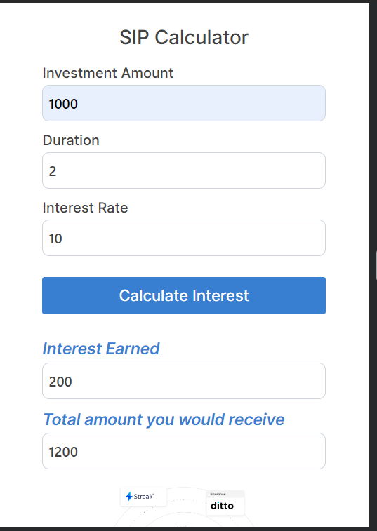

# **Zerodha**
## *Overview*
 A simplified and user-friendly clone of the hero section of Zerodha, with an added feature - Of Simple Interest Rate Calculator. This project aims to provide a clean and responsive design similar to Zerodha's hero section while incorporating a handy calculator for calculating simple interest rates.

## *Features*
- Mimics the design and layout of Zerodha's hero section.

- Simple Interest Rate Calculator: The calculator allows users to quickly calculate simple interest rates based on principal amount, interest rate, and time. This feature provides a practical tool for users to estimate interest earnings or expenses.

### *Technologies Used*
- HTML5
- CSS3
- JavaScript
- Bootstrap
Getting Started
Clone the Repository:

*To check the live page: [Click]()*

## *Screenshots*
- Hero Section

 

-Simple Interest Rate Calculator

License
This project is licensed under the MIT License - see the LICENSE file for details.

### *Acknowledgments*

Zerodha for inspiration and design cues.
Enjoy using this mini web application and exploring the world of finance with our Simple Interest Rate Calculator!